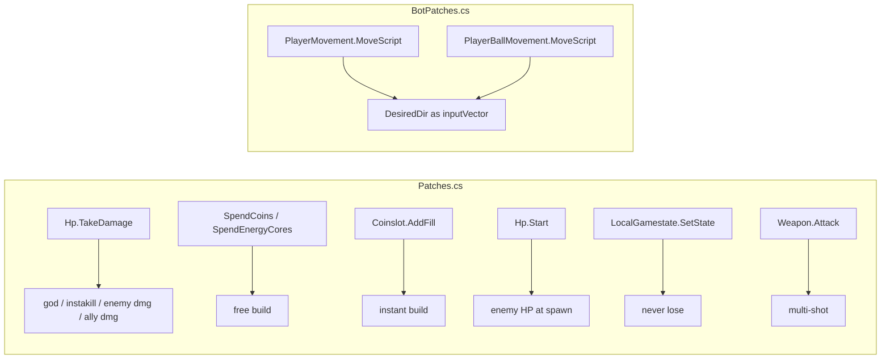

# Thronefall Trainer — Understanding Map (v3)

Read-only companion. How the pieces sit together today, and where the agent
layer attaches. Canonical repo docs stay canonical:

| File | Role |
|---|---|
| `README.md` | Cheats, install, overlay, adding a cheat |
| `AUTOPILOT.md` | Bot status, FSM, verified evidence, known issues |
| `BOT-DEV.md` | How to extend perception / modes / frames |
| `CONFIG.md` | Every BepInEx key |
| `TESTING.md` / `QUALITY.md` | Manual checklist · lint, diagnose, contracts |
| `AGENTIC-DESIGN.md` | Body + policy + brain + critic design, phases, DoD |
| `AGENTIC-RESEARCH.md` | Bibliography: papers, repos, patterns (kept as reference) |
| `AUDIT-LOG.md` | Audit items and dispositions, self-review passes |
| `IDEAS.md` | Ranked backlog |

---

## 1. Two products in one DLL (soon three layers)

```
ThronefallTrainer.dll
├── Trainer overlay (F1)   human cheats + meta writers            (Patches.cs, Plugin.cs)
├── Autopilot body  (F6)   FSM that plays the campaign            (Bot.cs, BotPerception.cs, BotPatches.cs)
└── Agent seam (planned)   BotBrain (pure Decide) · Recorder · PolicyTable · Mailbox   (Phase 0–2)

tf-agent (Docker, WSL2)    brain · evaluator · detectors · dashboard  (Phase 3–5)
```

Shared state is `Cheats`. F6 with `BotSurvivalCheats=true` snapshots your toggles,
forces the survival bundle, restores on F6-off. Bundle off ⇒ `Bot.Legit = true`.

---

## 2. Process & file layout

```
thronefall.exe
 └── BepInEx 5 (Doorstop)
      ├── plugins/ThronefallTrainer.dll
      ├── plugins/bot-log.jsonl                4 Hz telemetry (today)
      ├── plugins/agent/                       agent mailbox + memory (planned)
      │     policy.json  outbox.jsonl  inbox.jsonl  runs/  memory/  shots/
      └── config/dev.thronefall.trainer.cfg

src/
  Plugin.cs          1445 lines  BepInEx entry, IMGUI, Cheats, one-shots, bundle snapshot/restore
  Patches.cs          151        Harmony cheat hooks
  Bot.cs             1151        FSM, steering, watchdog, UI resolver, holds, army, jsonl
                                 (Phase 0: Decide moves to BotBrain.cs; Tick executes intents)
  BotPerception.cs    443        read-only Snapshot + build scoring + level scoring hook
                                 (Phase 0: split into SnapshotData (values) + SnapshotRefs (Unity objects))
  BotPatches.cs        43        MoveScript prefix → inputVector
decompiled/          711 files   ilspycmd dump of Assembly-CSharp — the API contract
decompiled_fog/                  KB.FogRTS.Runtime — fog of war (VisionSource, FogOfWarManager)
tools/               bot-lint.ps1 · bot-diagnose.ps1 · build-and-deploy.ps1 · decompile.ps1
```

---

## 3. Runtime data flow (today)

```
Unity frame
  Plugin.Update
    hotkeys F1–F6 · live cheat writes
    Bot.Tick()
      per frame:   DesiredDir = dir(hero → NavSteerPoint(AimPos))     (legit: A* waypoints)
      every 0.25s: Capture() → Snapshot → HandleBlockingFrame → Decide → RunWatchdog → LogLine
  BotPatches.MoveScript prefix     inputVector := camera-relative DesiredDir
  Patches.*                        TakeDamage / Spend* / AddFill / Hp.Start / SetState / Weapon.Attack
  Plugin.OnGUI                     IMGUI overlay (player frozen while open)
```

Two contracts: **perception is read-only**; **Decide carries only explicit
statics** (mode, holds, parks, session defeats, nav path, army phase).

---

## 4. Bot FSM (priority order, as coded in `Decide()`)

```mermaid
flowchart TD
  T[tick 0.25 s] --> V{Snapshot.Valid?}
  V -->|no| SM[_StartMenu → TransitionFromNullToLevelSelect · HandleBlockingFrame]
  V -->|yes| UI{ChoiceManager waiting or freezing UIFrame?}
  UI -->|yes| R[ResolveUI: choice → end-of-match → perk → generic]
  UI -->|no| MAP{NearestLevel != null?}
  MAP -->|yes| EL[EnterLevel: seed loadout → TransitionFromLevelSelectToLevel]
  MAP -->|no| DEAD{HeroDead?}
  DEAD -->|yes| RH0[ReturnHome / Idle]
  DEAD -->|no| DN{IsNight?}
  DN -->|night| HP{Legit && hp < 0.5?}
  HP -->|yes| RH[ReturnHome behind keep + PumpAttack]
  HP -->|no| EN[Engage CastleThreat]
  EN --> K{ranged?}
  K -->|yes| KITE[danger <5 m → behind keep · <kiteR → step away · else stand-off 70 %]
  K -->|no| LINE[hold castle+9 on threat axis]
  DN -->|day| COIN{coin ≤ 80 m?}
  COIN -->|yes| CC[CollectCoin]
  COIN -->|no| B{NearestBuild && (gold>0 or harvest)?}
  B -->|yes| SG[SpendGold: Focus → Begin → Hold 0.4 s · 7 s stall → park]
  B -->|no| AR{Legit && allies && armyPhase<2?}
  AR -->|yes| PA[PositionArmy: select-all → walk castle+11 → place → hold]
  AR -->|no| HN{HasHorn?}
  HN -->|yes| SN[StartNight: horn InteractionBegin]
  HN -->|no| SW[SwitchToNight fallback 15 s single-shot]
```

Day drain invariant: harvest → military → income → park dead slots → pool empty → night.

---

## 5. What the bot can see — today vs after Phase 1

| Cluster | Today | Phase 1 adds | Source |
|---|---|---|---|
| Hero | pos, hp %, dead | weapon range already cached in `PumpAttack` → move to Snapshot | `PlayerMovement`, `Hp`, `WeaponEquipper` |
| Economy | gold, cores, coins, scored slots | wall class, phase multipliers | `PlayerInteraction`, `TagManager.playerBuildingInteractors`, `UpgradeBranch.hpChange` |
| Threat | nearest enemy, castle threat, spawn-line anchor | **next-wave composition** (`NextWaveIndex`, count, elites, HP, range, speed, flying from prefab tag), foe range | `EnemySpawner.GetWaveInfoForNextWave()`, `GetNextWave()`, `TaggedObject.Contains(ETag.Flying)`, `AutoAttack.targetPriorities` |
| Army | count, centroid | placed bearing (for re-command) | `TagManager.PlayerUnits`, `CommandUnits` |
| Time | night flag, `DayTimeLeft`, raw wave index | `PreFinalWaveComingUp`, `LevelBeatenAsSoonAsWaveFinished`, `CastleHpPct` | `EnemySpawner`, castle `Hp.HpPercentage` |
| UI | active frame name, pending choice | **build-upgrade choice → branch class** (perk frames are separate) | `UIFrameManager`, `ChoiceManager.currentOriginBuildSlot`, `BuildSlot.upgradeSelected` (reflection) |
| Map | scored level nodes | — | `LevelInteractor`, `LevelProgressManager` |
| Shrines | — | list, activated, range | `Shrine` |
| Fog | — (omniscient) | optional filter (Phase 6) | `FogOfWarManager`, `VisionSource` |

`Wavenumber` semantics: starts at −1, increments in `StartSpawning`; during the day the raw value is the **last started** night and the player's "next night" is `Wavenumber + 1`. `GetWaveInfoForNextWave()` handles the offset; the Snapshot exposes `NextWaveIndex` and rules never use the raw value.

---

## 6. Harmony choke points (unchanged)



The agent layer adds **no** Harmony patches. It reads singletons and writes files.

---

## 7. Legit vs bundle (unchanged) + what policy may touch

| Capability | Bundle ON | Bundle OFF (`Legit`) | Policy knob? |
|---|---|---|---|
| God / never-lose / instakill / no CD | forced | as the player set | **never** |
| Attack | `Attack()` + `TakeDamage` fallback | `TryToAttack()` only | no |
| Movement recovery | teleport nudge | A* → sidestep → snap if embedded | `nav.holdSeconds` only |
| Army | optional | select-all → place → hold | `army.depth` |
| Build / choice scoring | same | same | `score.*`, `choice.*` |
| Stance | same | same | `stance.standoffFrac`, `stance.retreatHp` |
| Defeat | blocked | real, −45 node score | `request_level` bias only |

The knob table has no cheat entries; `bot-lint` fails if one appears.

---

## 8. Scoring today → scoring with policy

```
today:   score = 10 + harvest?1000 + military*100 + (incomeΔ>0 ? 30+3·min(Δ,10) : 0)
phase 2: score = Σ knob[k] · phaseMult[k] · class[k]      knobs clamped to [min,max]
         rules in policy.json add/set/mul knobs when their `when` matches the Snapshot
```

Stand-off aim 1.6 m outside the collider; hold pumps at 0.4 s; 7 s zero-progress → park for the day.

---

## 9. Navigation stack (legit, unchanged)

```
AimPos → MaybeRequestPath ~1 Hz (ABPath) → NavSteerPoint
   last wp > 2.5 m from goal → no-path → straight line + escalating sidestep (3→12 m)
   1-wp path under the hero  → straight line (the Nordfels "moved 0.00" trap)
   moved < 0.05 m            → GetNearest snap (embedded only)
```

Planned: `config/anchors.json` consulted before straight-line fallback (B2).

---

## 10. Campaign loop (unchanged) + loadout hook

```
_StartMenu → TransitionFromNullToLevelSelect
_LevelSelect → LevelScore (unbeaten +100, unplayed +15, −45/defeat) → seed loadout → TransitionFromLevelSelectToLevel
match → day/night FSM → AfterMatchVictory/Defeat → BackToLevelSelectHelper → map
```

Loadout seeding is where A7 attaches: `PerkManager.SetEquipped` with a
scene-specific legit loadout from memory instead of "best unlocked weapon".

---

## 11. Agent data contracts (the seam)

```
body → sidecar   agent/outbox.jsonl   {"t":…,"ev":"match-end","runId":…,"scene":…,"summary":{…}}
sidecar → body   agent/policy.json    JsonUtility-shaped (arrays); validated; temp+replace; body polls mtime at 1 Hz, keeps last-good
sidecar → body   agent/inbox.jsonl    {"cmd":"ephemeral-knob"|"nav-anchor"|"park-slot"|"level-bias", …}
body   → disk    agent/runs/<runId>/  ticks.jsonl (2 Hz DTO) · events.jsonl · summary.json
sidecar          polls files (1 s, byte offsets) — no inotify over DrvFs bind mounts
body   → disk    agent/shots/*.png    only on unknown-frame / wipe; deleted after use
```

Heartbeat: body rewrites `agent/alive.json` (`{"t":…, "runId":…, "policyVersion":…}`) every 10 s; the sidecar shows stale after 30 s. Sidecar down ⇒ body plays with the last good policy. Policy invalid
⇒ body keeps the previous one and emits `policy-reject`.

---

## 12. Reading a live log (unchanged, plus agent events)

Healthy legit session: `build-hold → build-stall → army-placed → switch-night →
foes drain → choice-pick / frame-close → match-end → transition-level`.

Agent-era additions: `rule-fired:<id>` (tapered), `policy-loaded:<version>`,
`policy-reject:<reason>`, `loadout:<names>`, `anomaly:<signature>`, `action:<name>:<verified|failed>`.

Measured on the 2026-09-29 log: 136 of 150 Nordfels wedges sit at one keep-interior cell (0, 4) in `SpendGold`; `After Match Frame ` (trailing space) is closed by the generic branch, never by the end-of-match branch; `army-placed` never fired. Those three are the first things Phase 0/1 must change.

Bad signatures stay the same (build-hold spam without stall, `bld` never 0,
`teleport-nudge` in legit, repeated `transition-level`, `stuck:3 + snap` at one
position) — they are now detectors in the sidecar, not only in `bot-diagnose.ps1`.
