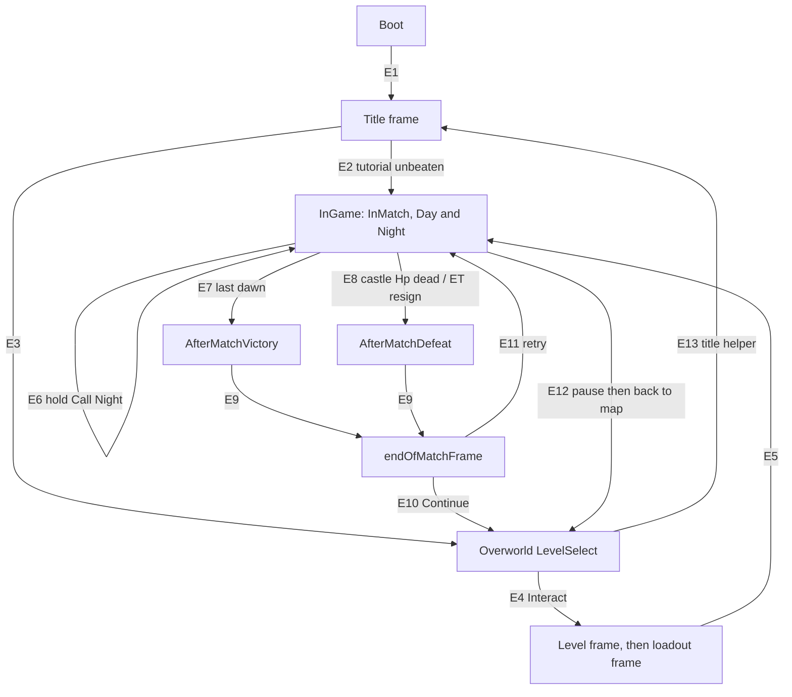

# 04 - Flow, UI, Progression

Static read of `decompiled\` only; nothing was run. Cites are `File.cs:line`. **F** = fact from code. **I** = inference (basis cited). *asset* = value serialized in scenes/prefabs/ScriptableObjects, absent from the decompile. STM = `SceneTransitionManager`. Independently fact-checked 2026-09-29: errors are corrected in place and listed in the Verification log at the end. Asset evidence tags: *(data)* = `reference\data` JSON (ui_frames, level_infos, equippables, levels/*); *(asset-read)* = read-only decode of `Thronefall_Data` with the project's `tools\refpack` reader (no game run).

## (a) Facts from code

**Boot / scenes**
- F1 `InitialSceneLoad` waits a frame, then async-loads build index 1 (= `_StartMenu`; build order `_Boot`, `_StartMenu`, `_UI`, `_LevelSelect`, levels from 4: *asset-read*), activating at progress >= 0.9 (InitialSceneLoad.cs:12-25). STM is a DontDestroyOnLoad singleton that loads `_UI` additively (SceneTransitionManager.cs:93-105). `UIFrameManager.Start` loads `_StartMenu` only if `sceneCount<=1`, deactivates all frames, and shows the title frame only if `_StartMenu` is already loaded (UIFrameManager.cs:115-128). `SaveLoadManager.Start` calls `LoadGame()`; a missing save is swallowed (SaveLoadManager.cs:45-48,144-152).
- F2 A failed `SteamAPI.Init` (Steam client not running) leaves `Initialized=false`; achievements, leaderboards, DLC checks then no-op/false (SteamManager.cs:97-100; Thronefall.GameServices/SteamGameServices.cs:9,19,28; SteamDlcProvider.cs:11-14). Not fully optional: a missing steam_api library or `RestartAppIfNecessary()==true` calls `Application.Quit()` (SteamManager.cs:82-96). Both Steam DLC app ids are `AppId_t.Invalid` (SteamDlcProvider.cs:5-7).
- F3 `SceneState` {MainMenu (default), LevelSelect, InGame} is set at request time from the target scene name (SceneTransitionManager.cs:11-16,184-195).
- F4 `TransitionToScene` silently drops requests while one runs (SceneTransitionManager.cs:181). Coroutine: fade-in (`cloudFadeInTime` 1 s, *asset-read* 1.0), unload all scenes but `_UI`, load target additively, `SetActiveScene`, `CloseAllFrames()`, title frame if main menu, fade-out (2 s, *asset-read* 2.0) (SceneTransitionManager.cs:34-36,206-269). Meanwhile frames ignore input, `Apply` is inert, Pause/Cancel are ignored (UIFrame.cs:105; ThronefallUIElement.cs:56; UIFrameManager.cs:155-158).
- F5 `TransitionFromLevelSelectToLevel` needs `CurrentSceneState==LevelSelect` (else warns, returns) (SceneTransitionManager.cs:116-125); `TransitionFromNullToLevel` has no check (SceneTransitionManager.cs:127-131); `RestartCurrentLevel` reloads the active scene (SceneTransitionManager.cs:133-136). The overworld to return to is remembered at departure (SceneTransitionManager.cs:310-322).
- F6 `TransitionFromGameplayToEndScreen` aborts unless state is InGame (SceneTransitionManager.cs:151-155). Classic: `highscore = score+gold+mutator+noRetry`, record flag vs `highscoreBest` (SceneTransitionManager.cs:160-165); then `UIFrameManager.TriggerEndOfMatch()` (SceneTransitionManager.cs:171).

**Title / tutorial**
- F7 `ClickPlay` is ignored for the first 4 frames (TitleScreenUIHelper.cs:8-17). If `Neuland(Tutorial)` has `highscoreBest>0 || beatenBest` -> `TransitionFromNullToLevelSelect()`; else clear loadout, equip `tutorialWeapon`, Classic, `TransitionFromNullToLevel(tutorial)` (TitleScreenUIHelper.cs:19-29).
- F8 Tutorial gates: night call needs `TutorialManager.AllowStartingTheNight`; in night 1 enemies keep respawning until the active attack stabbed 3 targets (PlayerInteraction.cs:81; TutorialManager.cs:132-142,395-404; EnemySpawner.cs:399-414). Tutorial retry restarts instantly, no loadout screen (LoadoutUIHelper.cs:88-93; EndscreenRetryHelper.cs:5-14).
- F9 Title pop-ups: `TitleScreenPopUpHelper` pushes `BeforeGamePopUp.uiFrame` via `ChangeActiveFrameKeepOldVisible`; `onlyShowOnce` uses PlayerPrefs `PopupShown_<id>` (TitleScreenPopUpHelper.cs:18-49). *asset-read*: no `TitleScreenPopUpHelper` exists in any scene/asset of this build and the Title frame's `onActivate -> PopNext` call has a null target (*data*: ui_frames.json 'Title Frame'), so title pop-ups never appear; the frames 'Early Access Warning' and 'Update 1.1' are opened by nothing.

**Match state machine**
- F10 States PreMatch/InMatch/AfterMatchVictory/AfterMatchDefeat; PreMatch is only the initial value, no code sets it. `Start` commits `SaveScoreAndStatsToBestIfBest(false)`, then enters InMatch if `autoStartMatch` (default true) (LocalGamestate.cs:14-20,27,76-82).
- F11 `SetState` is a no-op after a terminal state (LocalGamestate.cs:94). Victory: `beaten=true`, `MarkRunCompleteAndSave()` (LocalGamestate.cs:100-108); other states `beaten=false` (LocalGamestate.cs:109-116); defeat stops music (LocalGamestate.cs:117-120). Terminal states start `WaitThenTriggerEndOfMatchScreen`: wait 1 s scaled (1 frame if `immediate`), then `TransitionFromGameplayToEndScreen` (victory score,gold,mutator,noRetry; defeat score,0,0,noRetry) (LocalGamestate.cs:121-157).
- F12 Victory: night ends when `!SpawningInProgress && enemies<=0` (DayNightCycle.cs:112-115); after `sunriseTime` (code default 2.5 s; *data* 3.0 s in all 37 level scenes, levels/*.json) if `Wavenumber >= waves.Count-1` -> `SetState(AfterMatchVictory)` (DayNightCycle.cs:279-299). `Wavenumber` starts -1, +1 per dusk, clamped (EnemySpawner.cs:277,553-554). A timed day forces dusk (only if a choice is pending does it first cancel it and close all frames); a timed night forces dawn even with enemies alive (DayNightCycle.cs:116-138). *data* (levels/*.json autoDayNight): timed day only in 'Durststein Speedrun' (20 s); timed night only in 'Freifort MM1' (240 s) and 'Wildbach MM3' (120 s).
- F13 Defeat: a Hp in `objectsThatTriggerLoseWhenDestroyed` dies while InMatch (LocalGamestate.cs:83-88,159-165; Hp.cs:383-386; *asset-read*: the only trigger in all 37 level scenes is the castle Hp `BUILDINGS/Castle Center Variant/Building Parent`); ET resign (`ApplyResign`, reached only through the ET Resign pop-up's Yes: InMatchResignHelper.cs:23-27); ET save loaded with `inNight` (LocalMatchSaveLoad.cs:28-31). In classic the pause-menu 'Resign' calls `TryResign`, whose `classicRetryPopUp` is 'Classic Retry Mode Select Pop Up' (*asset-read*), a restart choice with no defeat (InMatchResignHelper.cs:11-21); `InGameResignUIHelper.Resign` (InGameResignUIHelper.cs:5-17) only sits on the 'InMatch Resign Frame', which no button or field opens.
- F14 Night call = hold "Call Night" `nightCallTime` (code default 1 s; *data* 2.0 s in all 37 level scenes, levels/*.json), only if not timed-day and `IsFreeToCallNight`: not frozen, no focussed interactor, CastleCenter object exists, tutorial allows, `!MatchOver`, InMatch (NightCall.cs:63-87; PlayerInteraction.cs:77-87; EnemySpawner.cs:81-89).

**Score / XP**
- F15 Each dawn: base 100 + time <=`timeScorePerNight` + protection <=`protectionScorePerNight` (multiplier fixed 1; code defaults protection/time 200/200, *asset-read* 250/250 in every level scene except 'Freifort MM1' base/protection/time 0/0/0 and 'Moorweg MM1' 600/0/0). time = linear 1 -> 0 as night length goes `timeBonusMinTime` -> `timeBonusMaxTime` beyond spawn duration (code 10 s -> 120 s, *asset-read* 5 s -> 90 s), ^exp; protection = (1-knockedOut/buildings)^exp; `highscore` = running total (ScoreManager.cs:154,157-199). `timebonusMultiplier`, `protectionScoreMultiplier` are unused (ScoreManager.cs:21,30).
- F16 Victory adds gold ceil(TrueBalance x10) and mutator ceil((score+gold)(product of `scoreMultiplyerOnWin` - 1)); code default 1.2 per mutator, *data* 1.1-1.75 per selectable mutator (equippables.json; the only value <1, 'God of Strength' 0.6, is not in `allEquippables` (*asset-read*) so it cannot be picked). Both outcomes add no-retry 10% (1% for `Stars` levels) unless the save has `hadRestarts`, which a save load sets when `EnemySpawner` is missing or `WaveCount>=2` (ScoreManager.cs:66-133; EquippableMutation.cs:7).
- F17 XP = total - `MatchSave.highestScoreThisRun` (>=0, only when a `MatchSave` exists: loaded, or created by a dawn save) (EndOfMatchScoreUIHelper.cs:378-387). Level-up: reward frame, `xp=0`, `level++` (EndOfMatchScoreUIHelper.cs:723-758). The ladder has 54 `metaLevels` (*asset-read*: 8 x 1500, 5 x 2000, 12 x 2500, 29 x 3000 XP). Past the last MetaLevel each level costs `xpNeededToProgressToNextLevelPastMaxMeta` (code default 4000; *asset-read* 100000) for the Trophy perk; `NextMetaLevel` never returns null, so the max-level UI is unreachable (PerkManager.cs:29-31,319-329; EndOfMatchScoreUIHelper.cs:484-499).
- F18 End-screen order: 1 s wait, frame active, pre-frame (`preFrameAnimationTime` code 0.75 s, *asset-read* 3.0 s, then `preFrameWaittime` *asset-read* 1.5 s), score unroll (<=~10 s; Interact skips), record pop, [first victory] campaign reward frame (`waitAfterReward` code 2 s, *asset-read* 3.5 s), `SubmitScoreAndSave` (cs:387), XP fill (`timeToFillUpABar` code 3 s, *asset-read* 2.0 s per bar; Interact accelerates), `SaveScoreAndStatsToBestIfBest(true)`, leaderboard upload, `SaveGame()`, then button group shown and default button selected (*asset-read*: victory -> 'Continue', defeat -> 'Try Again') (EndOfMatchScoreUIHelper.cs:197-250,308-439). Re-entry skips the animation (`endScreenShownThisMatch`, EndOfMatchScoreUIHelper.cs:214-217).

**UI frames**
- F19 `UIFrame` defaults: `freezePlayer=true`, `freezeTime=false`, `canNotBeEscaped=false` (UIFrame.cs:14-18). Each switch sets player freeze and `Time.timeScale` (0 if `freezeTime`, else `gameplayTimeScale`); a null frame clears the stack (UIFrameManager.cs:229-259). Frozen = movement input zeroed, no interact/attack, no night call, no select-all/control-group hotkeys (PlayerMovement.cs:165; PlayerInteraction.cs:81,152; CommandUnits.cs:163,293).
- F20 Only the active frame reads input: "Menu Apply" or "Interact" applies the selection; Menu Up/Down/Left/Right or Move axes navigate (needs a current selection); left click applies the hovered element, but only while `Cursor.visible` (UIFrame.cs:103-158,162,203-210,222-233). "Pause Menu" closes an escapable frame, or with no frame opens overworld pause (level-select scene) / in-match pause; "Cancel" closes an escapable non-title frame (UIFrameManager.cs:159-165,189-212). The cursor hides after 3 s while no frame/selection exists or the mouse is "sleeping" (keyboard navigation), and reappears only on pointer movement with a positive x or y delta (UIFrameManager.cs:22,171-186; UIFrame.cs:168-172,226).
- F21 `ChangeActiveFrame` pushes, `CloseActiveFrame` pops (or clears), KeepOldVisible leaves the old frame visible but non-interactable; `TryOpen*` silently fail while any frame is active (UIFrameManager.cs:219-227,275-306,319-365; UIFrame.cs:358-370).
- F22 Choices: 0/1 options resolve without UI; >=2 open choiceFrame with the player frozen; apply picks (locked ignored) and closes; closing unpicked cancels the pending build (ChoiceManager.cs:47-82; ChoiceUIFrameHelper.cs:141-149; UIFrameManager.cs:262-265; BuildSlot.cs:796-802; BuildingInteractor.cs:272-283).

**Level select / loadout**
- F23 Interactor playable iff `unlockRequirement` null or `Beaten` (= `beatenBest`). Interact on the nearest interactor within `interactionRadius` (3) sets static `lastActiveLevelInfo` and opens the level frame; interactors whose scene is not in the build deactivate (LevelInteractor.cs:61-71,164-168,199-206; LevelInfo.cs:78; PlayerInteraction.cs:15,150-161,191-214).
- F24 `LevelSelectUIFrameHelper.OnShow` calls `TryLoadRun(scene)`: loads `<scene>.json` and re-applies its saved loadout to `PerkManager.CurrentlyEquipped`; continue UI only if a save exists, `!ignoreSaves`, `!runComplete` (LevelSelectUIFrameHelper.cs:22-41; MatchSaveLoadHandler.cs:118-139; MatchSave.cs:124-173). Start = Classic + `TransitionFromLevelSelectToLevel`, wired through `TransitionToSelectedLevelHelper.TransitionToSelectedLevel` (TransitionToSelectedLevelHelper.cs:7-18; *data*); the identical `LevelSelectUIFrameHelper.TransitionToSelectedLevel` (LevelSelectUIFrameHelper.cs:43-47) is wired to no button. A level resumes iff `CurrentSave!=null && !OverwriteCurrentSave` when its `LocalMatchSaveLoad.Awake` runs (LocalMatchSaveLoad.cs:14-21; MatchSaveLoadHandler.cs:19-34).
- F25 Loadout: 1 weapon (first auto-equipped if none), <= `maxPerkCount` perks (default 5, *data* 5 except 'Freifort MM2' = 20; an extra pick evicts the oldest pick; on show excess is stripped from list end), unlimited mutators; locked ignored; `fixedLoadout` forces items and blocks edits; Cancel restores the buffered loadout unless locked in, but only on the in-match frame 'Perk Select Frame Classic InMap' (*asset-read*: it alone has `ResetLoadoutOnCancel` and `bufferLastLoadoutOnShow=true`; on the pre-level 'Perk Select Frame Classic' Cancel keeps the edits) (LoadoutUIHelper.cs:54-56,86-224,289-362; LevelInfo.cs:41-43; ResetLoadoutOnCancel.cs:9-25). At match start each `WeaponEquipper` destroys itself unless its `requiredWeapon` is equipped; the survivor equips the manual/auto attacks (WeaponEquipper.cs:15-36). The pause loadout view is read-only (`SetDataSimple`, PauseUILoadoutHelper.cs:99-143,219-224), so in classic play the loadout changes only in the pre-level loadout frame ('Perk Select Frame Classic', opened from the level frame's Play/New Game), via `TryLoadRun`, or in in-match perk select.
- F26 Legacy/inert (*asset-read*: none of these classes exists in any scene or asset of this build): `LevelSelectManager.PlayButtonPressed` does nothing because `openedLevel` is never assigned (LevelSelectManager.cs:43,83-94); `PlayLevelButton` is its only caller and is itself unreferenced, as are `AfterMatchUIManager`, `CancelOrOpenPauseMenu`, `LvlSelectTabButton`; `PerkSelectionGroup/Item` reference only each other (PlayLevelButton.cs:32-39).
- F27 After a match the avatar is teleported at frame 2 to the played level's interactor (TelePlayer.cs:24-31,33-65).

**Modes / settings**
- F28 Bonus hub playable iff `levelToBeatToUnlock` is null or beaten (*asset-read*: null in all nine hubs, so always playable; a mini-mode's own `unlockRequirement` (level_infos.json `requiresBeatenLevel`) is read only by `LevelInteractor.CanBePlayed`, never on this path); first Interact shows a one-time pop-up instead of the list (its Continue button then opens the list); list -> level frame (BonusLevelInteractor.cs:59-69,156-167; InGamePopUpHelper.cs:59-68; UIBonusLevelSelect.cs:84-101).
- F29 `DLCLevelInteractor` enters a DLC overworld; Craaghelm = `CraaghelmMarker` resource or Steam DLC, Fangmoor = asset flag or Steam (DLCLevelInteractor.cs:14-20; DlcConfiguration.cs:42,67-75). *asset-read*: no `DLCLevelInteractor` instance and no `CraaghelmMarker` GameObject exist in this build; the `DlcConfiguration` asset has `forceFangmoor`=false and empty map-name lists.
- F30 Eternal Trials (ET): interactor may show one-time pop-ups; per stage pick 1 of 3 (map+weapon+2 perks); victory = next stage, defeat ends the run; score = sum + stage^2 x1000; XP only at run end (EternalTrialsInteractor.cs:25-31; InGamePopUpHelper.cs:20-57; EternalTrialsRunManager.cs:7,110-211; EternalTrialsRun.cs:33-35; EternalTrialsDefeatUI.cs:222).
- F31 No global difficulty setting; difficulty is per-wave `Wave.difficultyMulti` (+x health, +x/2 damage) (Wave.cs:13; PauseUILoadoutHelper.cs:191-199). `SettingsResetUnitsMorning` writes PlayerPrefs `Gameplay_ResetUnitFormationEveryMorning` (default 1); at dawn it resets each unit's home position and hold-position (SettingsManager.cs:414-418,599,624; PathfindMovementPlayerunit.cs:206-213).
- F32 "Change Timescale" toggles static `gameplayTimeScale` 1<->2 (PlayerMovement.cs:99-112,154-157).

## (b) Inferences

- I1 titleFrame is `canNotBeEscaped`: Cancel exempts it, Pause does not (UIFrameManager.cs:191,199). Confirmed *data*: 'Title Frame' canNotBeEscaped=true.
- I2 endOfMatchFrame/levelUpRewardFrame are `canNotBeEscaped`; sequences wait on `frame.Interactable` (EndOfMatchScoreUIHelper.cs:475-478,746-749). Confirmed *data*: 'After Match Frame' and 'Level Up Frame' canNotBeEscaped=true (the latter also freezeTime=true).
- I3 choiceFrame has `freezeTime=false`, since timed days must tick while it is open (DayNightCycle.cs:116-127). Confirmed *data*: 'Choice Frame' freezeTime=false.
- I4 `noSavePlayButton` calls `SetOverrideSave(true)`; the two save-present buttons are continue (false) vs fresh (true); otherwise finished runs would resume (LevelSelectUIFrameHelper.cs:26-38,49-52; MatchSaveLoadHandler.cs:19-34). With a save present the default selection is `saveLowerButton` (LevelSelectUIFrameHelper.cs:29), so a blind Apply takes it. Assignment (*asset-read*): `saveLowerButton`='Continue Run' ('Continue Game'), `saveUpperButton`='New Run', `noSavePlayButton`='Play Button', so a blind Apply on a save resumes it; the `SetOverrideSave` values are confirmed by *data* (Continue Run false; Play Button and New Run true).
- I5 Unlock order follows `Equippable.LevelName`: Nordfels, Durststein, Frostsee, Uferwind, Sturmklamm, Wildbach, Moorweg, Freifort, Totend (Equippable.cs:13-25; EternalTrialsRunManager.cs:7). Real gating is asset `unlockRequirement`; confirmed *data* (level_infos.json `requiresBeatenLevel`): Neuland(Tutorial) -> Nordfels -> Durststein -> Frostsee -> Uferwind -> Sturmklamm -> Wildbach -> Moorweg -> Freifort -> Totend, each requiring its predecessor.
- I6 Files live in `Application.persistentDataPath` (Thronefall.SaveServices/SteamSaveServices.cs:89-92), on Windows `%USERPROFILE%\AppData\LocalLow\<company>\<product>`; PlayerPrefs in the registry.
- I7 `SavePlayerPrefs` is a no-op (Thronefall.SaveServices/SteamSaveServices.cs:81-83): a hard kill can lose popup/setting flags, so pop-ups may reappear.
- I8 `LocalGamestate.Start` may see a non-level active scene because STM calls `SetActiveScene` after load (SceneTransitionManager.cs:250; LocalGamestate.cs:78); the end-screen commit is authoritative.
- I9 Leaving via pause "back to map" keeps partial `highscore` in memory until that map starts again (ScoreManager.cs:184; LocalGamestate.cs:78; InMatchResignHelper.cs:29-39).
- I10 Refuted by *asset-read*: the 'After Match Frame' has `firstSelected` = null, so nothing is selected (and `Apply` is a no-op) until `frame.Select(...)` runs at the very end (UIFrame.cs:313-321,343-346; EndOfMatchScoreUIHelper.cs:416-438); early Interact cannot Apply a hidden button, it only skips animations (cs:199-209,707-710).

## (c) Flow

| E | Exact calls | Preconditions |
|---|---|---|
| E1 | `InitialSceneLoad.LoadFirstScene`; STM.Awake loads `_UI`; `UIFrameManager.Start` -> `SwitchToTitleFrame()` (InitialSceneLoad.cs:12-25; SceneTransitionManager.cs:102-105; UIFrameManager.cs:125-128) | `_StartMenu` already loaded (it is build index 1, *asset-read*) |
| E2 | `TitleScreenUIHelper.ClickPlay`: Clear/Add(tutorialWeapon), Classic, `TransitionFromNullToLevel("Neuland(Tutorial)")` (TitleScreenUIHelper.cs:25-29) | >=4 frames; tutorial `highscoreBest<=0` and not `beatenBest`; no transition running |
| E3 | `ClickPlay` -> `TransitionFromNullToLevelSelect()` (TitleScreenUIHelper.cs:19-23; SceneTransitionManager.cs:271-274) | tutorial `highscoreBest>0` or beaten |
| E4 | `PlayerInteraction.RunInteraction` -> `LevelInteractor.InteractionBegin` -> `TryOpenLevelSelect()` (PlayerInteraction.cs:156-161; LevelInteractor.cs:199-206; UIFrameManager.cs:319-327) | `CanBePlayed`, `ActiveFrame==null`, not frozen, Interact pressed near it |
| E5 | level frame 'Play Button'/'New Run' -> `SetOverrideSave(true)` -> loadout frame 'Perk Select Frame Classic' -> its 'Play Button'; or 'Continue Run' -> `SetOverrideSave(false)`; both end in `TransitionToSelectedLevelHelper.TransitionToSelectedLevel` -> `TransitionFromLevelSelectToLevel(sceneName)` (TransitionToSelectedLevelHelper.cs:7-18; *data*; `LevelSelectUIFrameHelper.TransitionToSelectedLevel`, cs:43-47, is wired to no button); then `LocalGamestate.Start` -> `SetState(InMatch)` (LocalGamestate.cs:76-82) | state LevelSelect (SceneTransitionManager.cs:118-122); continue vs fresh per `OverwriteCurrentSave` |
| E6 | `NightCall.UpdateFill` -> `DayNightCycle.SwitchToNight()` (NightCall.cs:73-87; DayNightCycle.cs:301-309) | `IsFreeToCallNight`; not `AutomatedDaytime` |
| E7 | `SwitchToDayCoroutine` -> `SetState(AfterMatchVictory)` (DayNightCycle.cs:279-299) | night over (F12), final wave reached |
| E8 | `Hp.OnKillOrKnockout` -> `OnVitalObjectKill` -> `SetState(AfterMatchDefeat)`; or (ET only) ET Resign pop-up Yes -> `InMatchResignHelper.ApplyResign` (LocalGamestate.cs:159-165; InMatchResignHelper.cs:23-27; *data*) | InMatch |
| E9 | `WaitThenTriggerEndOfMatchScreen` -> `TransitionFromGameplayToEndScreen` -> `TriggerEndOfMatch()` (LocalGamestate.cs:127-157; SceneTransitionManager.cs:147-172; UIFrameManager.cs:379-382) | still InGame after 1 s |
| E10 | `EndOfMatchScoreUIHelper.OnContinue` -> `TransitionFromEndScreenToLevelSelect()` (EndOfMatchScoreUIHelper.cs:252-255; SceneTransitionManager.cs:174-177) | button group visible (post-`SaveGame`); the default selection is 'Continue' on victory but 'Try Again' on defeat (*asset-read*), so on defeat move to 'Continue' ('Back Button' in 'Defeat Classic Buttons') first |
| E11 | defeat 'Try Again' -> `ChangeActiveFrame` 'Classic Retry Mode Select Pop Up' -> `EndscreenRetryHelper.RestartLastDay` ('Repeat Last Day', default selection) or `FreshStart` ('A Fresh Start') -> `OpenInMapPerkSelect()` -> its Play -> `RestartCurrentLevel()` (`justRestartCurrentLevel`=true there, *asset-read*); victory 'Try Again' -> `FreshStart` directly; the pop-up's `onActivate` runs `InstantRestartIfInSaveForbiddenMap` (EndscreenRetryHelper.cs:5-30; *data*). `EndOfMatchScoreUIHelper.OnTryAgain` (cs:257-260) is wired to no button | `RestartLastDay` sets `OverwriteCurrentSave=false` and re-applies the save loadout only if `Wavenumber>0`, then restarts; tutorial restarts instantly |
| E12 | Pause -> pause-frame 'Back to Map' (*data*) -> `InMatchResignHelper.TryBackToMap` -> `TransitionFromLevelToLevelSelect()` (InMatchResignHelper.cs:29-39) | `ActiveFrame==null` then Pause; no confirm in Classic |
| E13 | `BackToTitlescreenUIHelper.TransitionToMainMenu` -> `TransitionToMainMenu()`; coroutine ends `SwitchToTitleFrame()` (BackToTitlescreenUIHelper.cs:5-8; SceneTransitionManager.cs:252-255,287-290) | no transition running |

After-match frames in order: `endOfMatchFrame` (F18) -> optional `levelUpRewardFrame` pushed over it (`ShowLevelUpReward`, old frame kept visible) on first campaign clear and on each level-up -> back to `endOfMatchFrame` (UIFrameManager.cs:384-387; EndOfMatchScoreUIHelper.cs:441-482,723-758).

## (d) UIFrames the code opens

The only `UIFrame` subclass is `OverworldPauseFrame` (adds a DLC-only "return" button) (OverworldPauseFrame.cs:3-15). `canNotBeEscaped` blocks Cancel and Pause-to-close; `freezePlayer`/`freezeTime` per F19. Per-frame flags are *data* (ui_frames.json; exact table in the Verification log): `freezePlayer`=true on every frame, `canNotBeEscaped`=true only on the Title, After Match and Level Up frames, `freezeTime`=true on 19 of the 30 frames. `OverworldPauseFrame` (a subclass) is missing from ui_frames.json; *asset-read*: freezeTime=false, freezePlayer=true, canNotBeEscaped=false. Read `UIFrameManager.instance.ActiveFrame` (`freezePlayer`, `freezeTime`, `canNotBeEscaped`, `CurrentSelection`, `Interactable`) at runtime. Identify frames by child component.

| Frame (identify by) | Opened by | Blocks | Bot action |
|---|---|---|---|
| Title (`TitleScreenUIHelper`) | UIFrameManager.cs:136; SceneTransitionManager.cs:254 | Cancel exempt (UIFrameManager.cs:191); Pause blocked (`canNotBeEscaped`=true, *data*) | wait 4 frames, Apply Play; never Pause |
| Title pop-ups (`BeforeGamePopUp`) | TitleScreenPopUpHelper.cs:41 | title Play (only active frame gets input, UIFrame.cs:105) | never appear in this build (F9); if one did: Cancel, else Apply selected; repeat until title |
| Overworld pause (`OverworldPauseFrame`) | UIFrameManager.cs:203-207 | avatar (`freezeTime`=false, *asset-read*) | Pause/Cancel to close; buttons Continue / Settings / Main Menu (to title) / Level Select (DLC overworlds only, *asset-read*); avoid settings/quit |
| In-match pause (`PauseUILoadoutHelper`) | UIFrameManager.cs:208-211 | `freezeTime`=true (*data*) | Pause/Cancel to close; 'Back to Map' leaves the match at once (E12), 'Resign' opens the retry pop-up |
| Level frame ('Level Select Frame': `LevelSelectUIFrameHelper`) | LevelInteractor.cs:204; UIBonusLevelSelect.cs:99 | TryOpen fails if any frame active; `freezeTime`=false (*data*) | default selection: 'Continue Game' when a save is offered, else 'Play'; 'Play'/'New Game' open the loadout frame; Cancel = back |
| Loadout frame ('Perk Select Frame Classic': `LoadoutUIHelper`) | Play/New Game of the level frame (*data*) | `freezeTime`=false; Cancel keeps the edits (F25) | pick loadout, Apply 'Play Button'; Cancel = back |
| Bonus list (`UIBonusLevelSelect`) | UIFrameManager.cs:347-355 | - | Apply mini-mode; Cancel |
| One-time pop-ups (`InGamePopUpHelper`: ET first/patch, mini-modes) | InGamePopUpHelper.cs:20-67 | swallow the Interact (target frame not opened by it) | Apply their Continue button, which opens the target (ET select frame / bonus list) itself (*data*); or avoid ET/bonus |
| ET select / pick (`EternalTrialsSelectScreen`, `ETChoicePickScreen`) | UIFrameManager.cs:357-371 | - | avoid; Cancel |
| Wardrobe (`WardrobeHandler`) | WardrobeInteractor.cs:8-12 | - | avoid; Cancel (no `WardrobeInteractor` exists in this build's scenes, *asset-read*) |
| Choice (`ChoiceUIFrameHelper`) | ChoiceManager.cs:57-66; UIFrameManager.cs:409-412 | player frozen (ChoiceManager.cs:73) | Apply an unlocked choice (`Locked` ignored); Cancel aborts the build |
| endOfMatchFrame (`EndOfMatchScoreUIHelper`) | UIFrameManager.cs:379-382 | timeScale forced 0 (EndOfMatchScoreUIHelper.cs:216,354); I2 | wait for buttons; the default is 'Continue' on victory but 'Try Again' on defeat (*asset-read*), so on defeat select 'Continue' first |
| levelUpRewardFrame | UIFrameManager.cs:384-387 | parent non-interactable until closed | wait `waitAfterReward` (code 2 s, *asset-read* 3.5 s; Interact skips), Apply `rewardAcceptButton` ('Continue Reward Button'; selected by code, EndOfMatchScoreUIHelper.cs:474) |
| Retry / resign / back-to-map pop-ups (`InMatchResignHelper` fields) | InMatchResignHelper.cs:11-39 | - | classic 'Resign' opens 'Classic Retry Mode Select Pop Up' (Repeat Last Day / A Fresh Start: a restart, not a defeat); only the ET Resign pop-up's Yes resigns -> defeat; 'Back to Map' asks first only in an ET night; Cancel declines |
| In-match perk select | EndscreenRetryHelper.cs:16-20; UIFrameManager.cs:373-377 | - | choose loadout, Apply play |
| Settings, `resetControlsFrame`, `controlGroupTutorialUI`, highscore table | asset wiring; UIFrameManager.cs:414-417; SettingsEnableControlGroups.cs:15; HighscoreTable.cs:96-102 | - | Cancel; never Apply Reset Progress (its Settings button only opens a Yes/No confirm frame, *data*; GameProgressResetter.cs:11-44) or demo/quit switches (DemoQuitSwitch.cs:7-10; UIFrameManager.cs:314-317) |

## (e) Progression and saves

- Data: `LevelData` holds per-run (`beaten`, `highscore`) and best (`beatenBest`, `highscoreBest`, `levelHasBeenBeatenWith`) fields; entries are created on demand for any scene name except `_`-prefixed and the level-select scene (LevelData.cs:7-25; LevelProgressManager.cs:89-106).
- Levels: unlock when `unlockRequirement.Beaten` (`beatenBest`), committed at end-screen step `SaveScoreAndStatsToBestIfBest(true)` (also `LocalGamestate.Start` on next load) (LevelInteractor.cs:61-71; LevelData.cs:27-45; EndOfMatchScoreUIHelper.cs:413).
- Weapons, perks, mutators are `Equippable`s. `MetaLevel` type unlocks when `level > index+1` in `metaLevels` (absent from ladder = unlocked); `CampaignProgress` unlocks when `requiredBeatenLevel` scene is Beaten; first clear of a non-subtitle level shows its reward once (`beatenBest` still false) (Equippable.cs:72-90; PerkManager.cs:416-423; EndOfMatchScoreUIHelper.cs:441-482). `EquippableBuildingUpgrade` unlocks show no first-clear popup (EndOfMatchScoreUIHelper.cs:447-450). *data* (equippables.json): first-clear reward popups per level = Nordfels 2, Durststein 4, Frostsee 5, Uferwind 4, Sturmklamm 2, Wildbach 2, Moorweg 2, Freifort 2, Totend 0 (weapons + mutators; the 16 building upgrades unlock silently at Nordfels 7, Durststein 7, Uferwind 2). Building-upgrade choices need `requiresUnlocked.IsUnlocked` unless the level sets `allBuildingChoicesUnlocked` or mode is ET (Choice.cs:22-36; LevelProgressManager.cs:64-76).
- Quests/crowns: BeatTheLevel = `beatenBest`; AchieveScoreOf = `highscoreBest>=N`; With/Without evaluate stored victory loadouts, voided by `countQuestsAsIncompleteWith` items (*asset-read*: the single entry is the mutator 'God of Strength', which is not in `allEquippables` and so cannot be picked); each victory appends the equipped loadout (Quest.cs:29-89; LevelData.cs:36-39). Crowns sum quests of `Crowns` levels present in the build (*data*: 55 = Neuland 1 + nine campaign levels x 6; the 27 mini-modes are `Stars`, 3 quests each = 81); achievements at 5/10/20/30/40/50 (LevelProgressManager.cs:134-168; AchievementManager.cs:45-71).
- Saves (persistentDataPath):

| File | Written | Content |
|---|---|---|
| `ThroneSave.sav` + up to 16 timestamped copies | `SaveGame()`: end of each classic match (EndOfMatchScoreUIHelper.cs:415); ET defeat (EternalTrialsDefeatUI.cs:249); each dusk where `AfterTutorialTipManager` exists until 14 tips shown, then it unregisters (AfterTutorialTipManager.cs:60-64,82-84,397-400) | version, level/XP, ET best, tips; only levels with best>0 or beaten: best data + "Beaten With" (SaveLoadManager.cs:60-108; SafeFileWriter.cs:8-56) |
| `<scene>.json` | dawn +4 frames while `Wavenumber<Count-1`, never in the tutorial (*asset-read*: `disableAutomaticSaveLoading`=true there) (LocalMatchSaveLoad.cs:38-56,102-113); victory `runComplete` (LocalGamestate.cs:107); XP step (EndOfMatchScoreUIHelper.cs:387) | `MatchSave`: entity state, loadout, `hadRestarts`, `highestScoreThisRun` (MatchSave.cs:22-53) |
| `EternalTrials_V4.json`, `ET_CurrentLevel.json` | ET events (EternalTrialsRunManager.cs:110-216; LocalMatchSaveLoad.cs:116-132; EternalTrialsSelectScreen.cs:52) | ET run / match snapshot |
| PlayerPrefs | settings, popup flags, ET seed (SettingsManager.cs:289-490; EternalTrialsRunManager.cs:65,91) | - |

- "Reset game progress" moves (copy, then delete) every top-level persistentDataPath file except `ControlsConfig_v2.json` (neither copied nor deleted) into a `Before Reset Backup <timestamp>` folder, clears all level data and the equipped loadout, sets level 1 and XP 0, and returns to the title (GameProgressResetter.cs:11-44,62-65; SettingsManager.cs:671-674). The method has no confirmation in code; the Settings button only opens the Yes/No frame 'Reset Game Progress Frame' (*data*), whose Yes runs it.
- Equipped loadout is never in `ThroneSave.sav` (SaveLoadManager.cs:60-108); each launch starts from the inspector list (PerkManager.cs:12-13; *asset-read*: empty).
- Runner preference (derived): (1) tutorial; (2) newly unlocked unbeaten campaign levels (first-clear reward + unlocks); (3) beaten levels with open quests, using a loadout satisfying With/Without and score targets; (4) XP: one straight fresh run per level, since score-to-XP is 1:1 while continuing a dawn save sets `hadRestarts` and nets XP against `highestScoreThisRun` (ScoreManager.cs:126-133; EndOfMatchScoreUIHelper.cs:378-387). Defeats still pay XP for nights survived (SceneTransitionManager.cs:160-165).

## (f) Serialized fields with values in assets

| Field | Type | Meaning |
|---|---|---|
| `LocalGamestate.objectsThatTriggerLoseWhenDestroyed`, `autoStartMatch`, `currentState` | List<Hp>, bool, State | loss triggers; auto-start; initial state (LocalGamestate.cs:26-33). *asset-read*, all 37 level scenes: [castle Hp `Castle Center Variant/Building Parent`], true, PreMatch |
| `SceneTransitionManager.uiScene/mainMenuScene/levelSelectScene/...Craaghelm/...Fangmore`, `cloudFadeIn/OutTime` | string, float | scene names; fade times (SceneTransitionManager.cs:20-36). *asset-read*: `_UI`, `_StartMenu`, `_LevelSelect`, `_LevelSelectCraaghelm`, `_LevelSelectFangmoor` (the field name misspells it Fangmore); 1.0 s / 2.0 s |
| `LevelProgressManager.levelInfos` | LevelInfo[] | campaign registry (LevelProgressManager.cs:11). *data*: 51 LevelInfos, 37 of them have a scene in the build (10 campaign + 27 mini-modes) |
| `LevelInfo` sceneName, displayName, unlockRequirement, quests, fixedLoadout, maxPerkCount(5), contribution, ignoreSaves, allBuildingChoicesUnlocked, useSubtitle, enemySpawner, virtualBuildings | mixed | per-level rules (LevelInfo.cs:15-46) |
| `Quest` questType, beatTheLevelWith/Without, achieveScoreOf | enum, List<Equippable>, int | quest definitions (Quest.cs:15-21) |
| `PerkManager.metaLevels` (requiredXp, reward), `allEquippables`, `countQuestsAsIncompleteWith`, `currentlyEquipped`, `xpNeededToProgressToNextLevelPastMaxMeta` (code 4000, *asset-read* 100000), `trophyPerkForPastMaxMeta` | lists, int, Equippable | XP ladder (54 entries, F17), unlock order, quest-void perks (PerkManager.cs:13-31) |
| `Equippable` unlockRequirement, requiredBeatenLevel, availableToContentPack; `EquippableMutation.scoreMultiplyerOnWin` (code 1.2; *data* 1.1-1.75 per selectable mutator, F16) | enums, float | unlock gate; score multiplier (Equippable.cs:41-50) |
| `ScoreManager` base/protection/timeScorePerNight (code 100/200/200; *asset-read* 100/250/250), timeBonusMin/MaxTime (code 10/120; *asset-read* 5/90), scoreExponent 2, noRetry 1.1/1.01, victoryGoldBonusMultiplyer 10 | int, float | scoring constants (ScoreManager.cs:12-60); *asset-read* exceptions in F15; the other constants match the code |
| `NightCall.nightCallTime`, `DayNightCycle.sunriseTime` | float | code defaults 1 s, 2.5 s; *data* 2.0 s, 3.0 s in every level scene (levels/*.json) |
| `EnemySpawner` waves, goldBalanceAtStart (code 10; *data* 0-35 per level, 400 in 'Nordfels Siege'), endlessMode (*data*: only 'Totend MM1'), wave generators | List<Wave>, int, bool | wave count, start gold (EnemySpawner.cs:18-26,52-54) |
| `UIFrameManager` frame refs, `titleFrameSceneName`("_StartMenu"); each `UIFrame` flags, `firstSelected` | UIFrame, string, bool | which frame blocks what (UIFrameManager.cs:24-64); flags and `firstSelected` per frame are tabulated in the Verification log; *asset-read* `timeBeforeHideIdleCursor`=3.0 |
| `TitleScreenUIHelper.tutorialWeapon`, `TitleScreenPopUpHelper.popUpOrder`, `InGamePopUpHelper` pop-ups | Equippable, list | boot content. *asset-read*: `tutorialWeapon`='Long Bow'; no `TitleScreenPopUpHelper` exists; `InGamePopUpHelper` ids ET_First_Time, ET_Season_4, MM_Warning6 |
| `BonusLevelInteractor` levelsToPick/baseLevelInfo/levelToBeatToUnlock; `DLCLevelInteractor.DLCLevelSelectScene`; `DlcConfiguration.forceFangmoor`, map lists | mixed | bonus/DLC wiring. *data*: 9 hubs x 3 `levelsToPick` (level_select_nodes.json); *asset-read*: `levelToBeatToUnlock` null everywhere, no `DLCLevelInteractor`, `forceFangmoor`=false |
| `SaveLoadManager` saveFileName("ThroneSave.sav"), saveFileVersionNr(1), `allEquippablesID` | string, int, list | file name; "Beaten With" name lookup (SaveLoadManager.cs:10-25) |
| `EndOfMatchScoreUIHelper` button groups, waitAfterReward, timeToFillUpABar, preFrameAnimationTime, preFrameWaittime (code 2 / 3 / 0.75 / 0; *asset-read* 3.5 / 2.0 / 3.0 / 1.5) | GameObjects, floats | which buttons exist (EndOfMatchScoreUIHelper.cs:29-31,82-91,147-156) |

## (g) Bot implications (legit play, unattended)

1. **Never invoke** `SetState`, `Transition*`, `SaveGame`, or edit saves; drive Rewired actions ("Interact", "Menu Apply", "Menu Up/Down/Left/Right", "Move Horizontal/Vertical", "Call Night", "Cancel", "Pause Menu", "Change Timescale") or mouse. In-process read-only state: `SceneTransitionManager.instance.{CurrentSceneState,SceneTransitionIsRunning}`, `UIFrameManager.instance.ActiveFrame`, `LocalGamestate.Instance.CurrentState`, `EnemySpawner.instance.{Wavenumber,WaveCount,SpawningInProgress}`, `DayNightCycle.Instance.CurrentTimestate` (SceneTransitionManager.cs:71,91; UIFrameManager.cs:93; LocalGamestate.cs:60; EnemySpawner.cs:75-79; DayNightCycle.cs:56). Out-of-process: infer the same from screen and `ThroneSave.sav` mtime.
2. **Cold boot**: wait for `!SceneTransitionIsRunning`, Apply Play (title pop-ups do not occur in this build, F9). With no tutorial progress this starts the tutorial with no loadout screen and it cannot be skipped: satisfy its gates (F7, F8). A tutorial defeat with score>0 also sets `highscoreBest>0` (LevelData.cs:30-35), after which Play opens the overworld (TitleScreenUIHelper.cs:19-23).
3. **Overworld**: enumerate `LevelInteractor` (`levelInfo.sceneName`, `CanBePlayed`, `Quests`); walk toward the interactor (`PlayerTeleportPosition` is where the game parks the avatar after that level, LevelInteractor.cs:57; TelePlayer.cs:33-65); Interact only when `ActiveFrame==null` and no nearer interactor (ET selector, bonus hubs; *asset-read*: this build has no wardrobe or DLC interactor) (PlayerInteraction.cs:191-214). Re-set the loadout in the frame every time because `TryLoadRun` may overwrite it (F24); choose fresh unless continuing on purpose.
4. **Match loop**: build by day, step away from every interactor, hold "Call Night" >= `nightCallTime` (F14; 2.0 s in every level, *data*); the night ends by itself once spawning is done and no enemy remains, and the last dawn triggers victory (F12). Tutorial adds gates (F8). Unit formations/hold-positions reset each dawn while `ResetUnitFormationEveryMorning` is on (default), so reissue commands daily (F31). Optional 2x speed via "Change Timescale" persists across scenes (F32).
5. **Pace**: transitions take >=3 s (fades 1 s + 2 s, *asset-read*) and drop input (SceneTransitionManager.cs:34-36,181); use real time, since end screens run at `timeScale=0` (EndOfMatchScoreUIHelper.cs:354). Send nothing in the 1 s between terminal state and end screen: leaving early aborts the end screen (LocalGamestate.cs:146; SceneTransitionManager.cs:151-155).
6. **Run over** = `CurrentState` is AfterMatch* (terminal, LocalGamestate.cs:94). Progress is durable only once the button group is shown and `ThroneSave.sav` mtime advanced (EndOfMatchScoreUIHelper.cs:413-438); do not kill the process before. Do not spam Interact during the sequence: it skips animations, and once the button group shows it Applies the selected default, which on defeat is 'Try Again' (I10, E10); wait for `rewardAcceptButton` on reward frames.
7. **Unknown screen** ladder: (i) transition running -> wait (timeout ~120 s); (ii) `ActiveFrame==null`: MainMenu -> wait, never Pause (it opens the in-match pause, UIFrameManager.cs:208-211), and if still null after ~10 s restart the game; LevelSelect -> overworld logic; InGame -> gameplay; (iii) frame open in AfterMatch -> end-screen logic; (iv) else Cancel (a no-op with no frame, UIFrameManager.cs:189-195), re-check after 0.5 s; (v) if unchanged the frame is `canNotBeEscaped` (*data*: only the Title, After Match and Level Up frames): Apply the selection; if `CurrentSelection==null` keyboard navigation cannot start (UIFrame.cs:224), so wiggle the pointer with positive x/y deltas to reveal the cursor, then click (F20). Never Apply Resign, Reset Progress or Quit.
8. **Rotation**: after Continue the avatar sits at the last level (F27). Track `LevelData` (`beatenBest`, `highscoreBest`) and `LevelInfo.QuestsComplete()`; follow (e). Stop on crowns complete (`CrownsAchieved==CrownsAvailabe`, LevelProgressManager.cs:134-168) or a budget; XP levels are unbounded, each one past the 54-entry ladder costing 100000 XP (F17; PerkManager.cs:319-329).
9. **Avoid** ET, bonus, DLC, wardrobe; "Restart last day" (also the default of the pause-menu 'Resign' pop-up; `hadRestarts`, XP netted: EndscreenRetryHelper.cs:22-30; ScoreManager.cs:126-133); mid-run "back to map" (no confirm; abandons the match, the last dawn save stays continuable: InMatchResignHelper.cs:29-39).
10. **Shutdown** via the game's own menu after an end screen; hard kills can drop PlayerPrefs (I7).

## Open questions

- Actual `canNotBeEscaped`/`freezeTime`/`freezePlayer` per frame and button-to-method wiring (level frame, end screens, pop-ups): ANSWERED from ui_frames.json, see Verification log Q1 (all 30 frames tabulated).
- Whether Interact opening the level frame also Applies its first selection in the same frame: STILL OPEN. Nothing in the code guards it (UIFrame.cs:103-158) and `UIFrame` and `PlayerInteraction` both have script execution order 0 (*asset-read*), so their same-frame order is undefined; see Q2.
- Which Hp objects are loss triggers per level; exact `unlockRequirement` chain and quests per level: ANSWERED, see Verification log Q3 (one castle Hp everywhere; chain and quests from level_infos.json).
- How "Return to level select" in DLC overworlds resolves: `BackToLevelSelectHelper.TransitionToLevelSelect` calls `GetCurrentLevelSelectScene`, which may return the DLC scene (BackToLevelSelectHelper.cs:5-8; SceneTransitionManager.cs:282-285,315-322): ANSWERED, it returns the DLC overworld itself once a DLC level was played from it (Q4); moot in this build, whose build settings contain no DLC overworld scene (*asset-read*).
